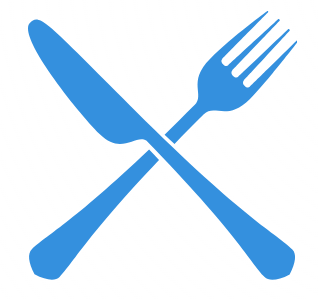
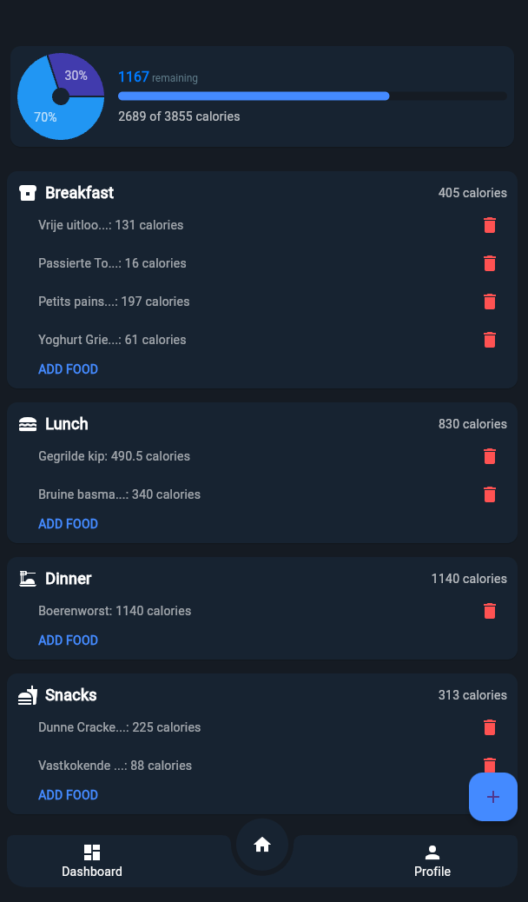
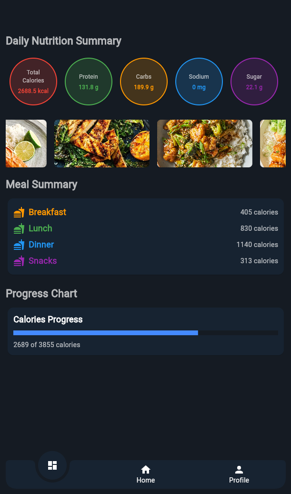
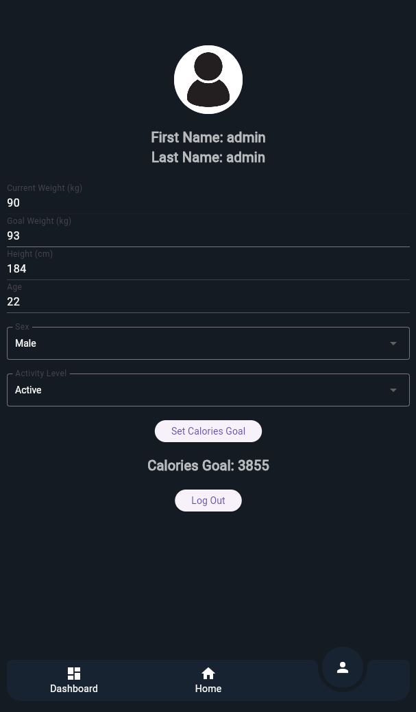
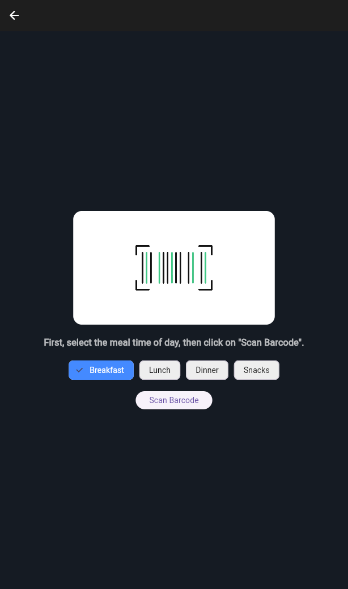

# MacroLens

# MacroLens

<p align="center">
  
</p>

MacroLens is a Flutter application designed to help you track what you eat. This app is developed as part of a college project at **Thomas More** for the course **Native Apps**.

## Features

- **Barcode Scanner**: Quickly scan food items to get nutritional information.
- **Meal Tracking**: Track your meals throughout the day.
- **Nutritional Summary**: Get a daily summary of your nutritional intake.
- **User Authentication**: Secure login and registration using Firebase.

## Screenshots

<p align="center">
  
  
  
  
</p>

## Getting Started

To get started with MacroLens, follow these steps:

1. **Clone the repository**:
    ```bash
    git clone https://github.com/YaronVansteenkiste/MacroLens-Eindopdracht.git
    cd macrolens_eindopdracht
    ```

2. **Install dependencies**:
    ```bash
    flutter pub get
    ```

3. **Run the app**:
    ```bash
    flutter run
    ```

## Project Structure

```plaintext
lib/
├── app_state.dart
├── barcode_scanner.dart
├── bottom_nav_bar.dart
├── dashboard_page.dart
├── firebase_options.dart
├── food_detail_page.dart
├── home_content.dart
├── library.dart
├── login_page.dart
├── main.dart
├── meal_info.dart
├── profile_page.dart
├── register_page.dart
└── video_player.dart
```

## Test user credentials:
Contact me for firebase.json, you put that in your root folder. 
The following account includes example data:
- **Email**: admin@macrolens.be
- **Password**: admin123
